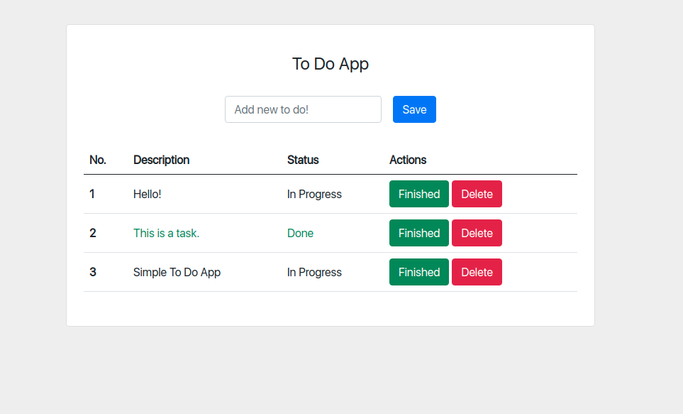

# To Do App

Simple To Do app with ReactJS.

## Installation

- If you want to use this project, you can clone to your local via  
  `git clone https://github.com/oktaygulec/simple-todo-app.git`

- Once you clone the project, you have to install the modules via `npm install`.

- To start the project `npm start`
